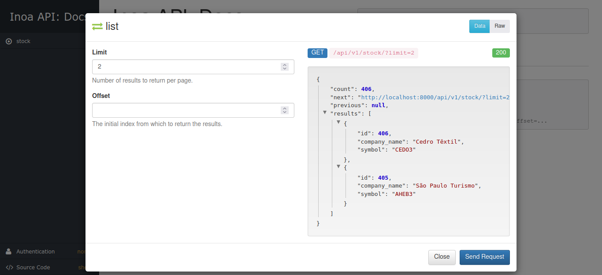

# Challenge Inoa

## Descrição do Projeto
Projeto desenvolvido para o processo seletivo da Inoa.

## Modelo de Dados
O modelo de dados foi desenvolvido com base no diagrama abaixo:

## Integração Continuada

## Documentação da API
> A documentação da API foi desenvolvida pela DRF e habilitada pelo endereço http://localhost:8000/api/docs/.
Basta iniciar a aplicação e acessar

<small>OBS.: O Swagger do DRF permite fazer requisições e testar a API online.</small>