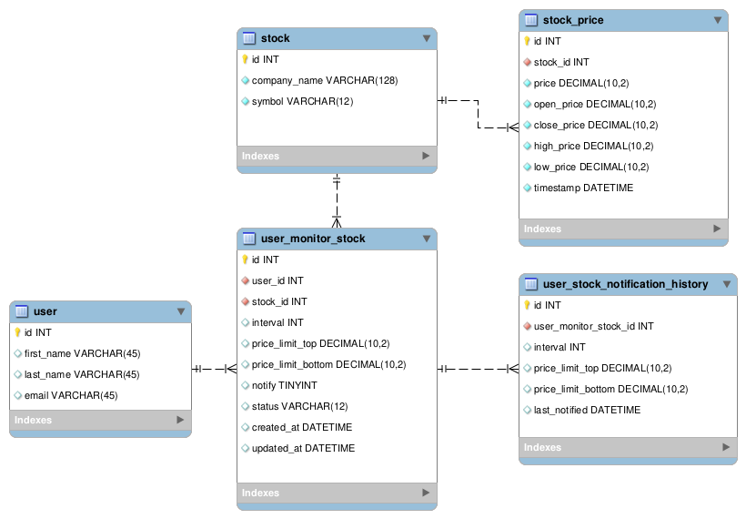

# Challenge Inoa


## Descrição do Projeto
Projeto desenvolvido para o processo seletivo da Inoa.

## Arquitetura do Projeto

> O sistema foi desenvolvido utilizando o DRF para a API e o Celery para a execução das tarefas assíncronas.
> É importante notar que o Celery utiliza o Redis como broker para a comunicação entre o Django e o Celery.
> O que possibilita a utilização do Redis como cache para a aplicação no futuro.


## Modelo de Dados
O modelo de dados foi desenvolvido com base no diagrama abaixo:


## Integração Continuada


#### Merge com segurança
> Branches protegidos no GitHub para garantir a qualidade do código (main e development).


## Documentação da API
> A documentação da API foi desenvolvida pela DRF e habilitada pelo endereço http://localhost:8000/api/docs/.
Basta iniciar a aplicação e acessar


<small>OBS.: O Swagger do DRF permite fazer requisições e testar a API online.</small>

## Executando como modo debug:
> Para executar em modo debug, basta rodar os comandos e seguir os passos abaixo:
```bash
  # cria o ambiente virtual e carrega as dependências
  make start-project
  # edite o arquivo .env e adicione as variáveis de ambiente
  vim .env
  # caso queira criar uma chave nova para o Django, execute o comando e cole o resultado no .env
  make create-key
  # execute as migrações
  make migration
  # importe os dados iniciais
  make import-b3
  # cria o usuário admin
  make create-user
  # após todas as variáveis e dependências estiverem corretas, execute o comando abaixo
  make run
```

## Executando como Docker:
> Para executar como docker, o ambiente local já deve possuir um arquivo db.sqlite3 com ao menos um usuário cadastrado.
> Sendo assim, é necessário executar sem o docker primeiro, e depois rodar o docker.
```bash
  make run-docker
```