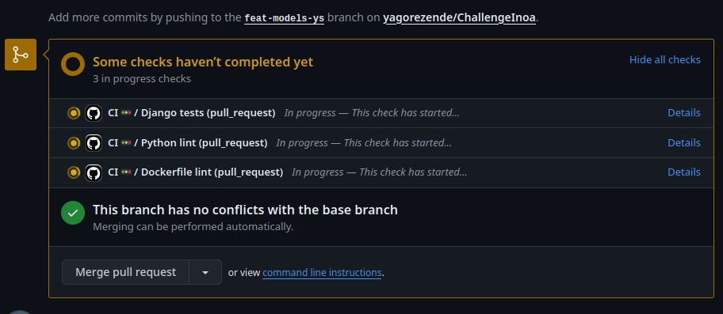

# Challenge Inoa

## Descrição do Projeto
Projeto desenvolvido para o processo seletivo da Inoa.

## Modelo de Dados
O modelo de dados foi desenvolvido com base no diagrama abaixo:

## Arquitetura do Projeto

> O sistema foi desenvolvido utilizando o DRF para a API e o Celery para a execução das tarefas assíncronas.
> É importante notar que o Celery utiliza o Redis como broker para a comunicação entre o Django e o Celery.
> O que possibilita a utilização do Redis como cache para a aplicação no futuro.

## Integração Continuada

#### Merge com segurança
> Branches protegidos no GitHub para garantir a qualidade do código (main e development).

## Documentação da API
> A documentação da API foi desenvolvida pela DRF e habilitada pelo endereço http://localhost:8000/api/docs/.
Basta iniciar a aplicação e acessar

<small>OBS.: O Swagger do DRF permite fazer requisições e testar a API online.</small>